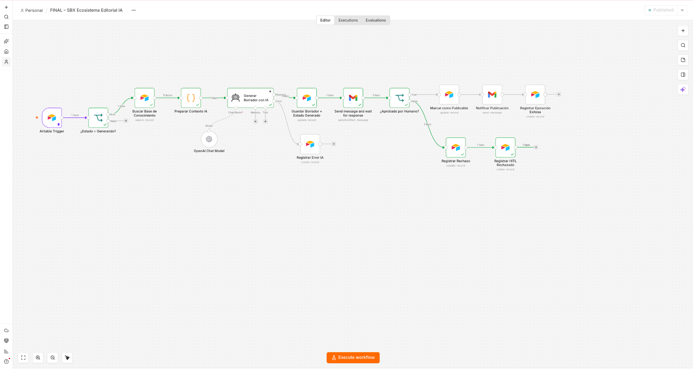
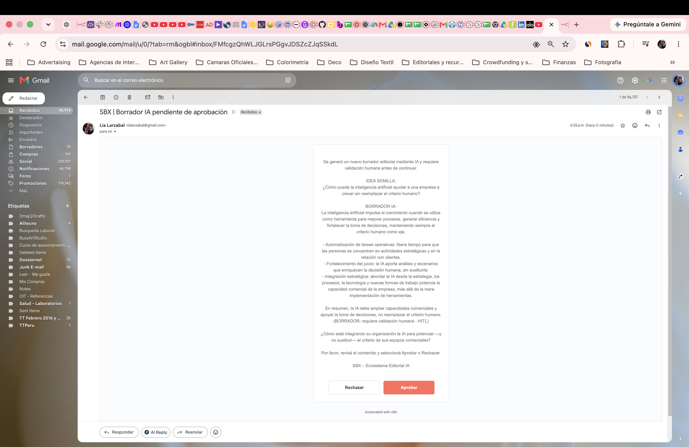
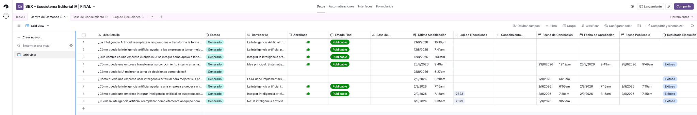
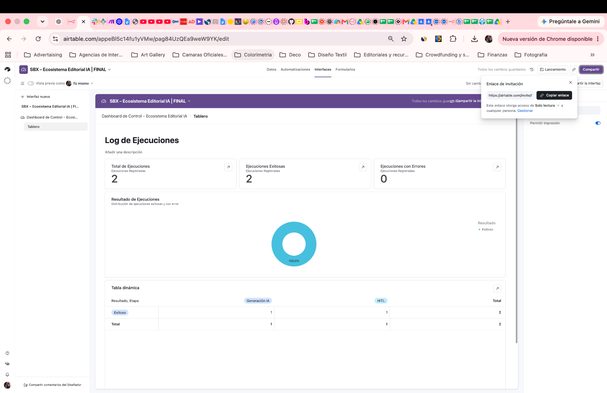

# SBX – Ecosistema Editorial IA

**Proyecto Final – AI Automation | Coderhouse**

Sistema de automatización editorial diseñado para transformar una **Idea Semilla** en un borrador generado mediante Inteligencia Artificial, utilizando conocimiento previamente validado y manteniendo **control humano antes de la decisión final**.

---

## 🎯 Objetivo del proyecto

Automatizar parte del proceso editorial de SBX sin delegar el criterio final a la Inteligencia Artificial.

El sistema permite:

- Detectar nuevas Ideas Semilla.
- Recuperar conocimiento institucional validado.
- Construir contexto dinámico para la IA.
- Generar borradores automáticamente.
- Solicitar aprobación humana antes de continuar.
- Separar los caminos de aprobación y rechazo.
- Registrar ejecuciones y errores.
- Monitorear el sistema mediante un Dashboard.

---

## 🧩 Arquitectura

El flujo principal está construido en **n8n** e integra:

**Airtable → Base de Conocimiento → OpenAI → Gmail HITL → Airtable → Dashboard**

### Componentes

| Componente | Tecnología | Función |
|---|---|---|
| Orquestación | n8n | Coordina triggers, lógica, IA, HITL y errores |
| Memoria | Airtable | Centro de Comando, Base de Conocimiento y Log |
| Inteligencia Artificial | OpenAI – GPT-5 mini | Generación del borrador |
| Validación humana | Gmail + HITL | Aprobar o rechazar antes de la acción crítica |
| Monitoreo | Airtable Interfaces | Dashboard y seguimiento de ejecuciones |

---

## 🧠 RAG y Base de Conocimiento

Antes de generar contenido, el workflow consulta la **Base de Conocimiento** en Airtable.

Solo los registros con estado **Publicado** son utilizados como contexto.

El nodo `Preparar Contexto IA` consolida la información recuperada y la entrega dinámicamente al modelo.

De esta manera, la IA trabaja sobre conocimiento previamente validado y no únicamente sobre información general.

---

## 👤 Human-in-the-Loop (HITL)

La automatización **no publica contenido de manera autónoma**.

Después de generar el borrador:

1. Airtable guarda el contenido.
2. Gmail envía el borrador para revisión.
3. El flujo espera una decisión humana.
4. La persona puede seleccionar **Aprobar** o **Rechazar**.
5. Solo la aprobación habilita el estado **Publicable**.

Este mecanismo mantiene el criterio humano en la acción crítica.

---

## 🗃️ Centro de Comando

Airtable funciona como memoria operacional del ecosistema.

Entre los principales campos se encuentran:

`Idea Semilla` · `Estado` · `Borrador IA` · `Aprobado` · `Estado Final` · `Fecha de Generación` · `Fecha de Aprobación` · `Log de Ejecuciones`

---

## 🛡️ Seguridad y resiliencia

El proyecto incorpora:

- Filtro de entrada para evitar reprocesamientos.
- Uso exclusivo de conocimiento con estado `Publicado`.
- Variables dinámicas en lugar de información fija.
- Validación booleana de la respuesta HITL.
- Manejo de errores del agente de IA.
- Registro de ejecuciones.
- Separación entre generación y publicación.
- Credenciales administradas dentro de n8n.
- JSON técnico sanitizado sin claves API.
- Aprobación humana obligatoria antes de la acción crítica.

---

## 💰 Optimización de costos

Se implementó **GPT-5 mini** como modelo principal para equilibrar capacidad, velocidad y costo.

La arquitectura evita llamadas innecesarias mediante filtros previos y solo ejecuta la generación cuando existe un registro válido para procesar.

La documentación técnica incluye la matriz comparativa de costos y el escenario utilizado para justificar la selección del modelo.

---

## 📊 Dashboard de Control

Airtable Interfaces permite monitorear:

- Total de ejecuciones.
- Ejecuciones exitosas.
- Ejecuciones con error.
- Distribución por resultado.
- Etapas de Generación IA y HITL.

### Vista Airtable – Solo lectura

[Abrir Airtable](https://airtable.com/invite/l?inviteId=invLWo9dCeSyuQaCp&inviteToken=c40278eff98ac441dd368eaeb509a1d7ec8d4335d2129d4cb9d23a7ba2f6394b&utm_medium=email&utm_source=product_team&utm_content=transactional-alerts)

---

## 📁 Archivos de la entrega

### Documentación completa

[📄 SBX – Entrega Final AI Automation](SBX_Entrega_Final_AI_Automation.pdf)

### Workflow n8n

[⚙️ SBX – Ecosistema Editorial IA – JSON Final](SBX_Ecosistema_Editorial_IA_FINAL.json)

### Evidencias

- [Arquitectura final n8n](01_arquitectura_n8n.png)
- [Centro de Comando Airtable](02_airtable_centro_comando.png)
- [Human-in-the-Loop Gmail](03_hitl_gmail.png)
- [Dashboard de Control](04_dashboard_control.png)

---

## 🎥 Video Demo

[▶️ Ver Video Demo Final – SBX Ecosistema Editorial IA](SBX_Ecosistema_Editorial_AI_Final_3min.mp4)

**Duración:** 2:58 min

La demostración muestra el recorrido completo:

**Idea Semilla → n8n → Base de Conocimiento → IA → Borrador → HITL → decisión humana → registro → Dashboard**

---

## 🛠️ Tecnologías utilizadas

`n8n` · `Airtable` · `OpenAI` · `GPT-5 mini` · `Gmail` · `JavaScript`

---

## Conclusión

**SBX – Ecosistema Editorial IA** demuestra cómo integrar Inteligencia Artificial dentro de un proceso de negocio sin perder gobernanza ni control humano.

La IA acelera la generación y sistematización del contenido, mientras que la arquitectura conserva tres principios fundamentales:

**conocimiento validado + trazabilidad + decisión humana.**
